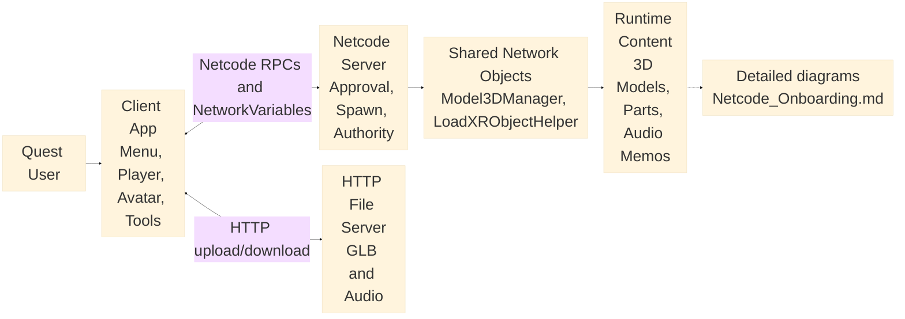
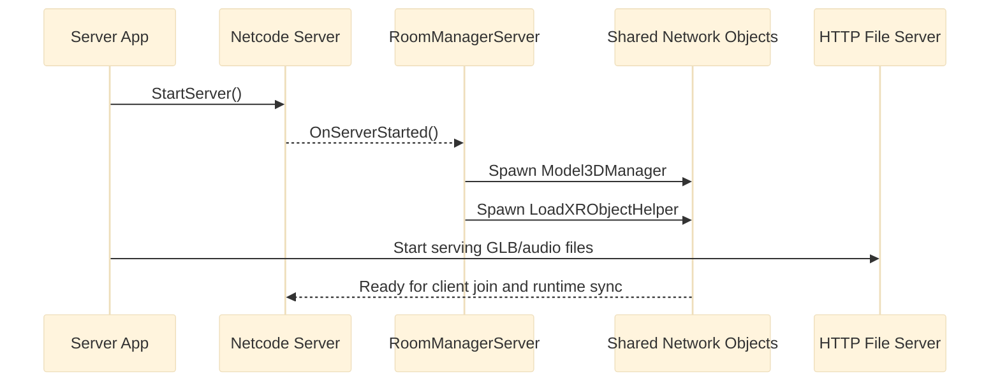
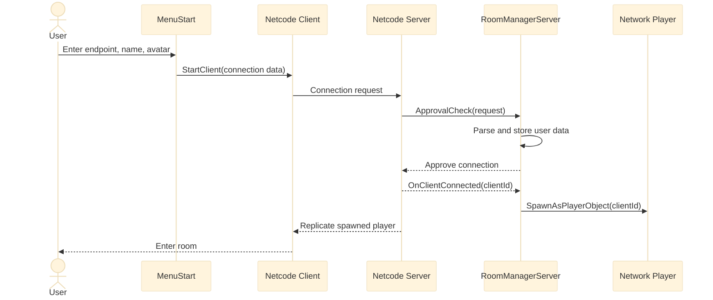
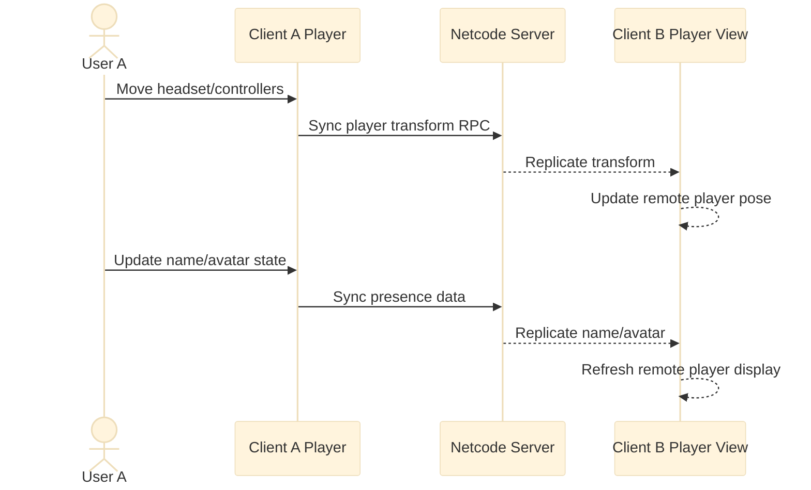
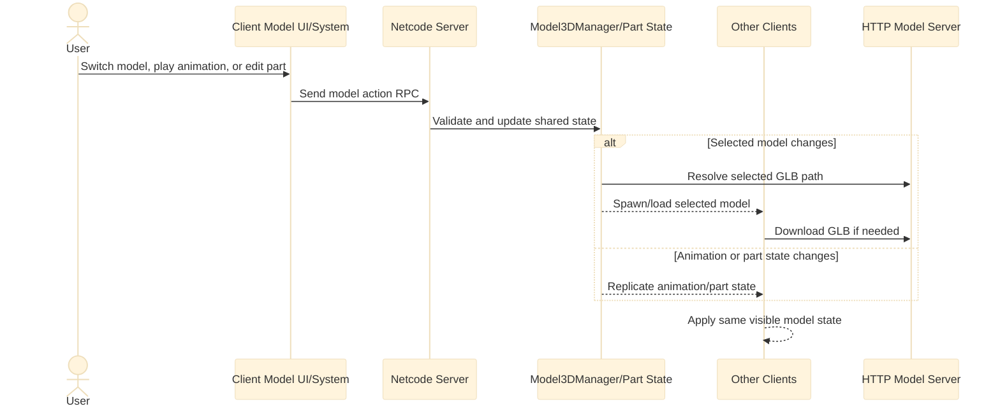
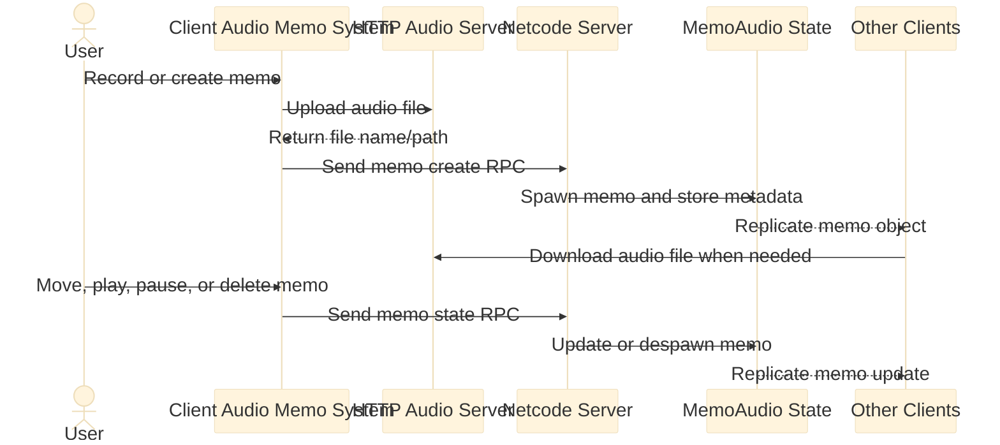
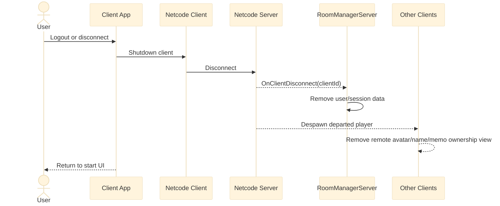

# ComJoVR App Sequence Overview V2

This version keeps the app-level view readable by splitting the whole app flow into small sequence slices. It is intended for customers or new developers who need the big picture first, then can open [Netcode_Onboarding.md](Netcode_Onboarding.md) for detailed per-feature diagrams.

## How To Read This Version

- Start with `0. App-Level Map` to understand the major systems.
- Read diagrams `1` to `6` in order for the normal app lifecycle.
- Each sequence diagram keeps only the actors needed for that stage.
- Detailed class-level flows remain in [Netcode_Onboarding.md](Netcode_Onboarding.md).

## 0. App-Level Map

## 1. Server Boot And Shared Object Setup

## 2. Client Join And Player Spawn

## 3. Player Presence Synchronization

## 4. Shared 3D Model Workflow

## 5. Audio Memo Workflow

## 6. Leave Room And Cleanup

## Detail Map

Use this V2 as the customer-facing app overview, then link to the detailed feature diagrams when needed:

- Server boot and join flow: [Netcode_Onboarding.md](Netcode_Onboarding.md), sections `3.1` to `3.5`.
- Player movement, name, and avatar: [Netcode_Onboarding.md](Netcode_Onboarding.md), sections `4.1` to `4.3`.
- 3D model switching, loading, animation, and parts: [Netcode_Onboarding.md](Netcode_Onboarding.md), sections `5.1` to `5.6`.
- Audio memo create, spawn, playback, transform, and delete: [Netcode_Onboarding.md](Netcode_Onboarding.md), sections `6.1` to `6.4`.

## Recommendation

Use this V2 as the main whole-app diagram document. Keep the original [Netcode_App_Sequence_Overview.md](Netcode_App_Sequence_Overview.md) as an internal scratch/complete lifecycle reference only if someone asks to trace everything in one place.
